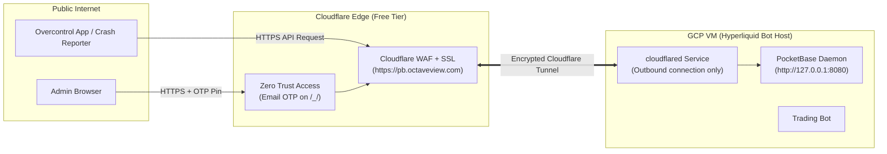

# PocketBase + Cloudflare Tunnel 1-Click GCP Deployment Guide (octaveview.com)

> **Target Domain:** `pb.octaveview.com`  
> **Host Server:** GCP Hyperliquid VM  
> **Security Model:** Zero Inbound Ports Open • Cloudflare Free Edge SSL • Zero Trust Admin OTP

---

## 🏗️ Architecture Overview



---

## 🚀 Part 1: Automated PocketBase Setup on GCP

SSH into your GCP VM and execute:

```bash
# Copy and run the deploy script on the VM:
bash deploy_pocketbase.sh
```

### Create Your Superuser / Admin Account:
Run this on the VM after installation:
```bash
cd /opt/pocketbase
./pocketbase superuser create admin@octaveview.com YourSecurePassword123!
```

---

## 🔒 Part 2: Cloudflare Tunnel Setup for `pb.octaveview.com`

### 1. Create Tunnel in Cloudflare Dashboard
1. Go to **Cloudflare Zero Trust Dashboard** ([one.dash.cloudflare.com](https://one.dash.cloudflare.com/)) $\rightarrow$ **Networks** $\rightarrow$ **Tunnels**.
2. Click **Create a Tunnel** $\rightarrow$ Select **Cloudflared** $\rightarrow$ Name it `octaveview-db`.
3. Choose **Debian / 64-bit** (AMD64 or ARM64 depending on your GCP machine).

### 2. Install `cloudflared` on GCP VM
Execute the command Cloudflare provides on your VM terminal:
```bash
# 1. Download and install cloudflared package
curl -L --output cloudflared.deb https://github.com/cloudflare/cloudflared/releases/latest/download/cloudflared-linux-amd64.deb
sudo dpkg -i cloudflared.deb

# 2. Register and start as a background systemd service:
sudo cloudflared service install <YOUR_CLOUDFLARE_TUNNEL_TOKEN>
```
*Verify service is running: `sudo systemctl status cloudflared`*

### 3. Route `pb.octaveview.com` to PocketBase
In the **Public Hostname** tab of your tunnel configuration:
1. **Subdomain:** `pb`
2. **Domain:** `octaveview.com`
3. **Path:** *(leave blank)*
4. **Type:** `HTTP`
5. **URL:** `localhost:8080` (or `127.0.0.1:8080`)
6. Click **Save Hostname**.

---

## 🛡️ Part 3: Lock Admin Panel Behind Zero Trust OTP

Keep your database admin portal completely invisible to internet bots:

1. In Cloudflare Zero Trust, go to **Access** $\rightarrow$ **Applications** $\rightarrow$ **Add an Application** $\rightarrow$ **Self-hosted**.
2. **Application Name:** `Octaveview DB Admin`
3. **Application Domain / Path:**
   - **Subdomain:** `pb`
   - **Domain:** `octaveview.com`
   - **Path:** `_/*`
4. **Add Policy:**
   - **Policy Name:** `Admin Email Only`
   - **Action:** `Allow`
   - **Include Rule:** Selector = `Emails` $\rightarrow$ Add your personal email.
5. Click **Save**.

*Now, visiting `https://pb.octaveview.com/_/` will require entering a 6-digit email PIN before even showing the PocketBase login screen!*

---

## 📋 Part 4: Update App Configurations

In your client application config ([Monolith/Dev/config.json](file:///c:/Users/pulak/Desktop/V4_RP2040_Zero_Webview_Main/Monolith/Dev/config.json)), point the database URL directly to your new Cloudflare HTTPS endpoint:

```json
{
  "pocketbase": {
    "url": "https://pb.octaveview.com"
  }
}
```

---

## 🎯 Verification URLs

| Service | URL | Authentication |
| :--- | :--- | :--- |
| **API Health Check** | `https://pb.octaveview.com/api/health` | Public (`{"code": 200, "message": "API is healthy."}`) |
| **Macro Hub API** | `https://pb.octaveview.com/api/collections/macros/records` | API Rules / Public Read |
| **Crash Ingestion API** | `https://pb.octaveview.com/api/collections/crash_reports/records` | Public Write / Admin Read |
| **Admin Dashboard** | `https://pb.octaveview.com/_/` | Cloudflare OTP + Superuser Login |
